# SAGA

[](https://claude.ai/code)
[](CHANGELOG.md)
[](https://opensource.org/licenses/MIT)
[](https://github.com/Roeia1/saga)

> **S**tructured **A**utonomous **G**oal **A**chievement - Transform epic ideas into shipped code through structured planning, autonomous execution, and continuous journaling.

A complete development lifecycle from epic ideation through story breakdown and rigorous implementation. Epics define the vision. Stories deliver the value. Workers execute autonomously. Everything is documented.

```mermaid
flowchart LR
    A[📝 Epic] -->|VISION| B[📋 Stories]
    B -->|BREAKDOWN| C[⚡ Implement]
    C -->|TDD| D((✅))

    A -.- A1[epic.md]
    B -.- B1[story.md]
    C -.- C1[journal.md]
```



## Table of Contents

- [Quick Start](#quick-start)
- [How It Works](#how-it-works)
- [Key Features](#key-features)
- [Skills Reference](#skills-reference)
- [Workflow Examples](#workflow-examples)
- [Directory Structure](#directory-structure)
- [Non-Negotiable Rules](#non-negotiable-rules)
- [Plugin Architecture](#plugin-architecture)
- [Requirements](#requirements)
- [Contributing](#contributing)

---

## Quick Start

### Installation

**Option 1: From GitHub (Latest)**

```bash
# Add the marketplace
/plugin marketplace add Roeia1/saga

# Install latest version
/plugin install saga@core
```

**Option 2: Specific Version**

```bash
# Install a specific version
/plugin install saga@core@1.0.0
```

**Option 3: Interactive**

```bash
# Browse and install via menu
/plugin
# Select "Browse Plugins" → find saga → install
```

See [CHANGELOG.md](CHANGELOG.md) for version history.

### Initialize Your Project

```bash
# Navigate to your project
cd your-project

# Start Claude Code
claude

# Initialize SAGA
> /init
```

This creates the `.saga/` directory structure:

```
.saga/
├── epics/        # Epic definitions and stories
├── archive/      # Completed story archives
└── worktrees/    # Git worktrees for story isolation (gitignored)
```

### Your First Epic

```bash
# 1. Create an epic (vision + architecture)
> /create-epic user authentication with OAuth

# 2. Generate stories from the epic
> /generate-stories user-auth

# 3. Implement a story autonomously
> /implement login-flow

# 4. If blocked, resolve and continue
> /resolve login-flow
> /implement login-flow
```

---

## How It Works

### Epic/Story Development Lifecycle

| Phase | Focus | Output |
|-------|-------|--------|
| **Epic Creation** | WHAT + HOW | `epic.md` - Vision, goals, architecture, success criteria |
| **Story Generation** | BREAKDOWN | `story.md` - Self-contained stories with tasks and guidance |
| **Story Execution** | DO the work | Tested, documented, reviewed code |

### Epic Creation

Tell Claude what you want to build in natural language:

```
> /create-epic real-time notifications for order updates
```

Claude will:
- Define the vision and goals
- Identify key requirements and success criteria
- Design high-level architecture
- Iterate with you until the epic is clear

**Output**: `.saga/epics/order-notifications/epic.md`

### Story Generation

Once the epic is defined:

```
> /generate-stories order-notifications
```

Claude breaks down the epic into implementable stories:
- Each story is self-contained with clear tasks
- Stories include implementation guidance and patterns
- Creates git branch + worktree for each story
- Opens draft PRs automatically

**Output**: Multiple stories in `.saga/epics/order-notifications/stories/`

### Story Execution

Stories are executed autonomously using the `/implement` command:

```
> /implement websocket-setup
```

The orchestrator spawns worker Claude instances that complete tasks incrementally. Workers exit with:
- **FINISH** - All tasks complete
- **BLOCKED** - Needs human decision (use `/resolve` to unblock)
- **TIMEOUT** - Max time exceeded

---

## Key Features

### Test-Driven Development (Non-Negotiable)

Tests are written **before** implementation. After test creation, they can only be modified with explicit user approval. This isn't optional—it's enforced.

### Continuous Journaling

Workers document progress throughout execution:
- Tasks completed and their outcomes
- Technical decisions and their reasoning
- Blockers and resolutions
- Key learnings and insights

**Output**: `journal.md` alongside each story

### Parallel Execution with Git Worktrees

Work on multiple stories simultaneously:

```
.saga/worktrees/
└── order-notifications/
    ├── websocket-setup/    # Full project checkout
    ├── event-handlers/     # Full project checkout
    └── ui-components/      # Full project checkout
```

Each worktree is isolated. Commit, push, and test independently.

### Dynamic Story Status

No manual status updates. Status is derived from filesystem and git state:

| Status | Signal |
|--------|--------|
| `PENDING` | Worktree exists, no `journal.md` |
| `IN_PROGRESS` | Worktree exists, `journal.md` present |
| `BLOCKED` | IN_PROGRESS with unresolved blocker in journal |
| `REMOTE` | Open PR, no local worktree |
| `COMPLETED` | PR merged, files archived |

---

## Skills Reference

All functionality is accessed through skills (slash commands):

| Skill | Command | Description |
|-------|---------|-------------|
| Initialize | `/init` | Create `.saga/` directory structure |
| Create Epic | `/create-epic [description]` | Define epic with vision and architecture |
| Generate Stories | `/generate-stories [epic-slug]` | Break epic into implementable stories |
| Implement | `/implement [story-slug]` | Execute story autonomously |
| Resolve | `/resolve [story-slug]` | Analyze and resolve blockers |

### Internal Skills

| Skill | Description |
|-------|-------------|
| Generate Story | Creates a single story (used by generate-stories) |

---

## Workflow Examples

### Complete Epic Development

```bash
# Session 1: Create epic and generate stories
> /create-epic shopping cart with guest checkout
# Review and refine the epic vision and architecture
> /generate-stories shopping-cart
# Review proposed stories, approve

# Session 2: Execute stories autonomously
> /implement cart-api
# Workers complete tasks, document in journal.md
# If blocked, use /resolve to provide resolution
# When complete, PR is ready for review and merge

> /implement checkout-flow
# Continue with next story
```

### Handling Blockers

```bash
# Worker exits with BLOCKED status
> /resolve cart-api
# Analyze blocker from journal.md
# Review proposed solutions
# Approve resolution

# Continue implementation
> /implement cart-api
```

---

## Directory Structure

```
your-project/
└── .saga/
    ├── epics/
    │   └── shopping-cart/
    │       ├── epic.md              # Vision, goals, architecture
    │       └── stories/
    │           ├── cart-api/
    │           │   ├── story.md     # Story definition and tasks
    │           │   └── journal.md   # Execution log
    │           └── checkout-flow/
    │               ├── story.md
    │               └── journal.md
    ├── archive/                      # Completed stories (tracked)
    │   └── shopping-cart/
    │       └── cart-api/
    │           ├── story.md
    │           └── journal.md
    └── worktrees/                    # Git worktrees (gitignored)
        └── shopping-cart/
            └── cart-api/             # Full project checkout
```

---

## Non-Negotiable Rules

1. **Test-Driven Development** - Tests before implementation, always
2. **No Test Tampering** - Tests locked after creation without approval
3. **Continuous Journaling** - Every decision documented
4. **Commit Discipline** - Commit and push at logical milestones

---

## Git Commit Convention

```bash
# Story-based commits
git commit -m "test(cart-api): add shopping cart endpoint tests"
git commit -m "feat(cart-api): implement add-to-cart functionality"
git commit -m "fix(cart-api): handle empty cart edge case"
```

---

## Plugin Architecture

```
plugin/
├── .claude-plugin/
│   └── plugin.json           # Plugin manifest
├── skills/                    # Core skills
│   ├── init/                 # /init - Initialize structure
│   ├── create-epic/          # /create-epic - Define epics
│   ├── generate-stories/     # /generate-stories - Break down epics
│   ├── generate-story/       # Internal - Create single story
│   ├── execute-story/        # /implement - Autonomous execution
│   └── resolve-blocker/      # /resolve - Handle blockers
├── scripts/
│   └── identifier_resolver_v2.py
├── hooks/
│   └── session-init.sh       # Session startup & context detection
└── docs/
    └── ENVIRONMENT.md        # Environment variable reference
```

---

## Requirements

- [Claude Code CLI](https://github.com/anthropics/claude-code) installed
- Git repository initialized
- GitHub CLI (`gh`) for PR operations

---

## Contributing

Contributions are welcome! Please:

1. Fork the repository
2. Create a feature branch
3. Follow the existing code patterns
4. Submit a pull request

For maintainers, see [RELEASING.md](RELEASING.md) for the version release process.

---

## License

MIT License - see [LICENSE](LICENSE) for details.

---

## Author

**Roei Avrahami** - [GitHub](https://github.com/Roeia1)

---

<p align="center">
  <b>Stop the chaos. Ship with discipline.</b>
  <br><br>
  <a href="https://github.com/Roeia1/saga">GitHub</a> ·
  <a href="https://github.com/Roeia1/saga/issues">Issues</a>
</p>
