# Claude Task System

[](https://claude.ai/code)
[](CHANGELOG.md)
[](https://opensource.org/licenses/MIT)
[](https://github.com/Roeia1/claude-task-system)
[](https://github.com/Roeia1/claude-task-system)

> Transform feature ideas into shipped code through structured planning, test-driven development, and documented decisions.

A complete development lifecycle from feature ideation through planning, task breakdown, and rigorous execution. Every phase requires human review. Tests come first. Decisions are documented. Nothing gets lost.

```mermaid
flowchart LR
    A[📝 Define] -->|WHAT| B[🏗️ Plan]
    B -->|HOW| C[📋 Generate]
    C -->|BREAKDOWN| D[⚡ Execute]
    D -->|TDD| E((✅))

    A -.- A1[feature.md]
    B -.- B1[plan.md]
    C -.- C1[tasks/]
    D -.- D1[journal.md]
```



## Table of Contents

- [Quick Start](#quick-start)
- [How It Works](#how-it-works)
- [Key Features](#key-features)
- [Commands & Skills Reference](#commands-reference)
- [Workflow Examples](#workflow-examples)
- [Directory Structure](#directory-structure)
- [Non-Negotiable Rules](#non-negotiable-rules)
- [Plugin Architecture](#plugin-architecture)
- [Requirements](#requirements)
- [Contributing](#contributing)

---

## Quick Start

### Installation

**Option 1: From GitHub (Latest)**

```bash
# Add the marketplace
/plugin marketplace add Roeia1/claude-task-system

# Install latest version
/plugin install claude-task-system@claude-task-system
```

**Option 2: Specific Version**

```bash
# Install a specific version
/plugin install claude-task-system@claude-task-system@1.0.0
```

**Option 3: Interactive**

```bash
# Browse and install via menu
/plugin
# Select "Browse Plugins" → find claude-task-system → install
```

See [CHANGELOG.md](CHANGELOG.md) for version history.

### Initialize Your Project

```bash
# Navigate to your project
cd your-project

# Start Claude Code
claude

# Initialize the task system
> /task-system:init
```

This creates the `task-system/` directory structure:

```
task-system/
├── features/     # Feature definitions and technical plans
├── tasks/        # Git worktrees for parallel task execution
├── archive/      # Completed task archives
└── adrs/         # Architecture Decision Records
```

### Your First Feature

```bash
# 1. Define what to build
> define feature user authentication with OAuth

# 2. Create the technical plan
> plan feature

# 3. Generate executable tasks
> generate tasks

# 4. Start working (in task worktree)
> start task 001
```

---

## How It Works

### Three-Phase Development Lifecycle

| Phase | Focus | Output |
|-------|-------|--------|
| **Feature Definition** | WHAT to build | `feature.md` - Requirements, user stories, acceptance criteria |
| **Technical Planning** | HOW to build | `plan.md` - Architecture, tech choices, implementation strategy |
| **Task Execution** | DO the work | Tested, documented, reviewed code |

### Feature Definition

Tell Claude what you want to build in natural language:

```
> define feature real-time notifications for order updates
```

Claude will:
- Generate user stories and acceptance criteria
- Identify functional and non-functional requirements
- Flag ambiguities with `[NEEDS CLARIFICATION: ...]` markers
- Iterate with you until requirements are crystal clear

**Output**: `task-system/features/001-real-time-notifications/feature.md`

### Technical Planning

Once requirements are defined:

```
> plan feature
```

Claude designs the implementation through 7 phases:
1. High-level architecture & components
2. Technology selection (with ADRs for major decisions)
3. Data modeling
4. API design
5. Implementation strategy
6. Testing strategy
7. Risk assessment

**Output**: `task-system/features/001-real-time-notifications/plan.md`

### Task Generation

Break down the plan into executable tasks:

```
> generate tasks
```

Claude proposes tasks for your review. After approval:
- Creates git branch + worktree for each task
- Generates comprehensive `task.md` files
- Opens draft PRs automatically
- Links everything back to the feature

**Output**: Multiple task worktrees in `task-system/tasks/`

### Task Execution

Each task follows a type-specific workflow with **mandatory phases**:

```
> start task 001
```

**Feature Workflow** (TDD-driven):
1. **Test Creation** - Write failing tests first
2. **Implementation** - Code to pass tests
3. **Refactor** - Improve quality, maintain coverage
4. **Verification** - Confirm acceptance criteria
5. **Reflection** - Document learnings

Other workflows: `bugfix`, `refactor`, `performance`, `deployment`

---

## Key Features

### Test-Driven Development (Non-Negotiable)

Tests are written **before** implementation. After test creation, they can only be modified with explicit user approval. This isn't optional—it's enforced.

### Architecture Decision Records

Document every significant technical choice:

```
> create ADR for WebSocket vs Server-Sent Events
```

ADRs capture:
- Problem statement and context
- Options considered with pros/cons
- Decision rationale
- Consequences (positive and negative)

### Continuous Journaling

A dedicated journaling subagent documents throughout execution:
- Phase transitions and milestones
- Technical decisions and their reasoning
- Blockers and how they were resolved
- Learnings and insights

**Output**: `journal.md` alongside each task

### Parallel Execution with Git Worktrees

Work on multiple tasks simultaneously:

```
task-system/tasks/
├── 001/    # Full project checkout for task 001
├── 002/    # Full project checkout for task 002
└── 003/    # Full project checkout for task 003
```

Each worktree is isolated. Commit, push, and test independently.

### Dynamic Task Status

No manual status updates. Status is derived from filesystem and git state:

| Status | Signal |
|--------|--------|
| `PENDING` | Worktree exists, no `journal.md` |
| `IN_PROGRESS` | Worktree exists, `journal.md` present |
| `REMOTE` | Open PR, no local worktree |
| `COMPLETED` | PR merged, files archived |

```
> list tasks
```

### Resume Work Anywhere

Continue tasks from any machine:

```
> resume task 017
```

Creates local worktree from the remote branch and picks up where you left off.

### TMUX Integration (Auto-Navigation & Cleanup)

When running inside TMUX, the task system provides seamless navigation and cleanup:

**Auto-Navigation**: Start a task from anywhere—Claude automatically navigates to the correct worktree:

```bash
# From main repo or wrong worktree
> start task 015
# → Spawns Claude in task-system/tasks/015/ automatically
# → No manual cd required
```

**Automatic Cleanup**: After merging a PR, cleanup happens automatically:

```bash
# After task completion in worktree
> # Grant completion permission
# → PR merged
# → "Spawn cleanup pane? [Y/n]"
# → New TMUX pane handles worktree removal
```

Without TMUX, manual instructions are provided for both operations.

---

## Commands Reference

All non-internal skills are available as both skills (natural language) and slash commands:

| Command | Description |
|---------|-------------|
| `/task-system:init` | Initialize task-system directory structure |
| `/task-system:feature-definition [description]` | Create feature requirements document |
| `/task-system:feature-planning [feature-id]` | Design technical implementation plan |
| `/task-system:task-generation [feature-id]` | Generate executable tasks from plan |
| `/task-system:task-list` | Show all tasks with status |
| `/task-system:task-start [task-id]` | Begin task execution workflow |
| `/task-system:task-resume [task-id]` | Continue remote task locally |
| `/task-system:task-cleanup [task-id]` | Remove worktree after PR merge |
| `/task-system:architecture-decisions [topic]` | Document architectural decisions |

## Skills Reference

Skills can be invoked via natural language. Most are also available as slash commands (see Commands Reference above).

| Skill | Activation | Description |
|-------|------------|-------------|
| Feature Definition | "define feature [description]" | Create feature requirements document |
| Feature Planning | "plan feature" | Design technical implementation |
| Task Generation | "generate tasks" | Break feature into executable tasks |
| Task Start | "start task [id]" | Begin task execution workflow |
| Task List | "list tasks" | Show all tasks with status |
| Task Resume | "resume task [id]" | Continue remote task locally |
| Task Cleanup | "cleanup task [id]" | Remove worktree after PR merge |
| Architecture Decisions | "create ADR for [topic]" | Document architectural decisions |

---

## Workflow Examples

### Complete Feature Development

```bash
# Session 1: Define and plan
> define feature shopping cart with guest checkout
# Review and clarify requirements
> plan feature
# Review and approve technical design
> generate tasks
# Review proposed tasks, approve

# Session 2: Execute task (in worktree)
$ cd task-system/tasks/001
$ claude
> start task 001
# Complete TDD workflow with phase gates
# Grant completion permission -> PR merged

# Session 3: Cleanup (from main repo)
$ cd ../../../  # Back to main repo
$ claude
> cleanup task 001
# Worktree removed, task fully completed
```

### Bug Fix

```bash
> start task 005  # Task type: bugfix

# Phase 1: Investigation
# - Reproduce the bug
# - Identify root cause

# Phase 2: Test Creation
# - Write test that captures the bug

# Phase 3: Fix
# - Apply minimal fix
# - Validate edge cases

# Phase 4-5: Verification & Reflection
```

### Recording an ADR During Development

```bash
# While working on a task
> create ADR for choosing PostgreSQL over MongoDB

# ADR created and linked to current feature
# Documented: task-system/features/001-auth/adr/001-postgres-choice.md
```

---

## Directory Structure

```
your-project/
└── task-system/
    ├── features/
    │   └── 001-feature-name/
    │       ├── feature.md      # What to build
    │       ├── plan.md         # How to build
    │       ├── tasks.md        # Task reference
    │       └── adr/            # Feature-specific ADRs
    │           └── 001-decision.md
    ├── tasks/                   # Git worktrees (gitignored)
    │   └── 001/                # Full project checkout
    │       └── task-system/
    │           └── task-001/
    │               ├── task.md     # Task definition
    │               └── journal.md  # Execution log
    ├── archive/                 # Completed tasks (tracked)
    │   └── 001/
    │       ├── task.md
    │       └── journal.md
    └── adrs/                    # Global ADRs
        └── 001-decision.md
```

---

## Non-Negotiable Rules

1. **Test-Driven Development** - Tests before implementation, always
2. **Phase Gates** - Explicit permission required to proceed between phases
3. **No Test Tampering** - Tests locked after creation without approval
4. **Continuous Journaling** - Every decision documented
5. **Commit Discipline** - Commit and push at phase boundaries
6. **Sequential Phases** - No skipping, no shortcuts

---

## Git Commit Convention

```bash
# Phase-based commits
git commit -m "test(task-001): add auth endpoint test suite"
git commit -m "feat(task-001): implement JWT authentication"
git commit -m "refactor(task-001): extract token validation"
git commit -m "docs(task-001): verification complete"
```

---

## Plugin Architecture

```
plugin/
├── .claude-plugin/
│   └── plugin.json           # Plugin manifest
├── agents/
│   ├── journaling.md         # Documents decisions throughout
│   ├── task-builder.md       # Creates tasks in parallel
│   └── task-completer.md     # Handles PR merge (cleanup done separately)
├── commands/                  # Slash commands (9 total)
│   ├── init.md               # /task-system:init
│   ├── task-list.md          # /task-system:task-list
│   ├── task-start.md         # /task-system:task-start
│   └── ...                   # (all reference instructions/)
├── instructions/              # Centralized instruction content
│   ├── task-start/
│   │   ├── INSTRUCTIONS.md
│   │   └── workflows/
│   ├── feature-definition/
│   │   ├── INSTRUCTIONS.md
│   │   └── templates/
│   └── ...                   # (12 instruction directories)
├── scripts/
│   └── claude-spawn.sh       # Spawn Claude in different directory (TMUX)
├── skills/                    # Thin wrappers (reference instructions/)
│   ├── feature-definition/SKILL.md
│   ├── task-start/SKILL.md
│   └── ...                   # (12 skill wrappers)
└── hooks/
    └── session-init.sh       # Session startup
```

---

## Requirements

- [Claude Code CLI](https://github.com/anthropics/claude-code) installed
- Git repository initialized
- GitHub CLI (`gh`) for PR operations
- TMUX (optional, enables auto-navigation and automatic cleanup)

---

## Contributing

Contributions are welcome! Please:

1. Fork the repository
2. Create a feature branch
3. Follow the existing code patterns
4. Submit a pull request

For maintainers, see [RELEASING.md](RELEASING.md) for the version release process.

---

## License

MIT License - see [LICENSE](LICENSE) for details.

---

## Author

**Roei Avrahami** - [GitHub](https://github.com/Roeia1)

---

<p align="center">
  <b>Stop the chaos. Ship with discipline.</b>
  <br><br>
  <a href="https://github.com/Roeia1/claude-task-system">GitHub</a> ·
  <a href="https://github.com/Roeia1/claude-task-system/issues">Issues</a>
</p>
