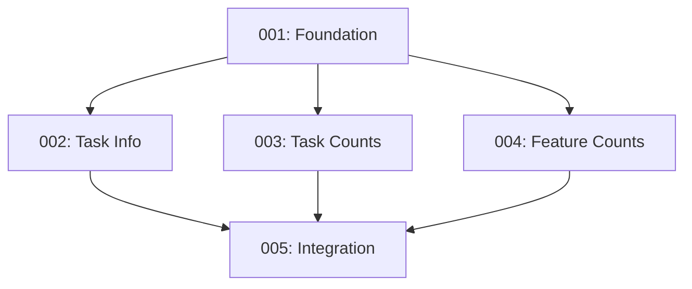

# Tasks for Feature 001: Statusline Task System Integration

Generated from: plan.md
Generated: 2025-12-13

## Task List

| ID | Title | Type | Priority | PR | Dependencies |
|----|-------|------|----------|-----|--------------|
| 001 | Create npm package structure and foundation script | feature | P1 | [#14](https://github.com/Roeia1/claude-task-system/pull/14) | None |
| 002 | Implement task information parsing | feature | P1 | [#12](https://github.com/Roeia1/claude-task-system/pull/12) | 001 |
| 003 | Implement task counts scanning | feature | P1 | [#11](https://github.com/Roeia1/claude-task-system/pull/11) | 001 |
| 004 | Implement feature counts scanning | feature | P2 | [#13](https://github.com/Roeia1/claude-task-system/pull/13) | 001 |
| 005 | Integration and powerline formatting | feature | P1 | [#15](https://github.com/Roeia1/claude-task-system/pull/15) | 002, 003, 004 |

## Dependencies

## Execution Order

### Recommended Sequence

1. **Task 001** (Foundation - must be first)
2. **Tasks 002 + 003 + 004** (can be parallel after 001)
3. **Task 005** (final integration, after 002-004 complete)

### Parallel Execution Strategy

After Task 001 completes, the following tasks can run concurrently:
- Task 002 (Task Info) - works on task.md parsing
- Task 003 (Task Counts) - works on worktree/git scanning
- Task 004 (Feature Counts) - works on feature.md scanning

These tasks modify different functions within the same script but don't conflict.

## Worktree Locations

| Task | Worktree Path | Branch |
|------|---------------|--------|
| 001 | `task-system/tasks/001/` | `task-001-feature` |
| 002 | `task-system/tasks/002/` | `task-002-feature` |
| 003 | `task-system/tasks/003/` | `task-003-feature` |
| 004 | `task-system/tasks/004/` | `task-004-feature` |
| 005 | `task-system/tasks/005/` | `task-005-feature` |

## Next Steps

1. Use `list tasks` to see current task status
2. `cd task-system/tasks/001` and start a Claude session
3. Say `start task 001` to begin the workflow
