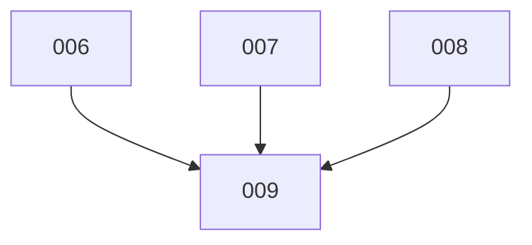

# Tasks for Feature 002: Automatic Task Cleanup via TMUX Terminal Spawning

Generated from: [plan.md](./plan.md)
Generated: 2025-12-21

## Task List

| ID | Title | Type | Priority | PR |
|----|-------|------|----------|-----|
| 006 | Create spawn-cleanup.sh Script with Tests | feature | P1 | [#19](https://github.com/Roeia1/claude-task-system/pull/19) |
| 007 | Update task-cleanup Skill with Location Detection | feature | P1 | [#18](https://github.com/Roeia1/claude-task-system/pull/18) |
| 008 | Simplify task-completer Agent | refactor | P1 | [#17](https://github.com/Roeia1/claude-task-system/pull/17) |
| 009 | Documentation Updates | feature | P2 | [#16](https://github.com/Roeia1/claude-task-system/pull/16) |

## Dependencies

## Execution Strategy

**Phase 1 - Implementation (parallel):**
- Task 006, 007, 008 can all be executed in parallel

**Phase 2 - Documentation:**
- Task 009 after Phase 1 completes
