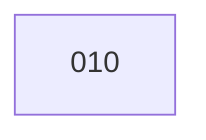

# Tasks for Feature 003: Claude Spawn - Same-Pane Session Handoff

Generated from: plan.md

## Task List

| ID  | Title                                              | Type    | Priority | PR  |
| --- | -------------------------------------------------- | ------- | -------- | --- |
| 010 | Implement claude-spawn.sh and integrate with task-start | feature | P1       | #20 |

## Dependencies

## Execution

Single task - no parallel execution needed.

**To start:**
1. `cd task-system/tasks/010`
2. Start a new Claude session
3. Say "start task 010"
