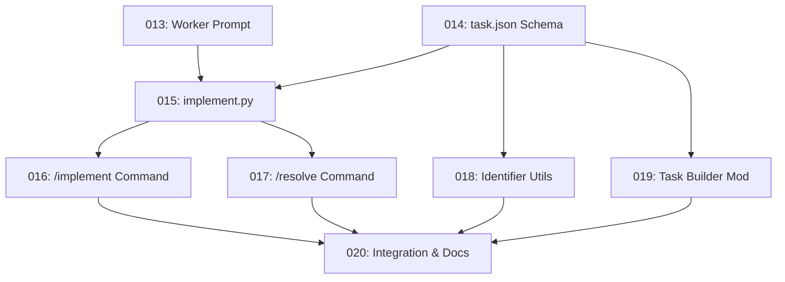

# Tasks for Feature 007: Task Implementation Orchestration

Generated from: plan.md
Generated: 2026-01-07

## Task List

| ID  | Title                                        | Type    | Priority | PR  |
| --- | -------------------------------------------- | ------- | -------- | --- |
| 013 | Create worker prompt template                | feature | P1       | #24 |
| 014 | Create task.json schema and templates        | feature | P1       | #25 |
| 015 | Create implementation script (implement.py)  | feature | P1       | #29 |
| 016 | Create /implement command                    | feature | P1       | #26 |
| 017 | Create /resolve command                      | feature | P1       | #30 |
| 018 | Create identifier resolution utilities       | feature | P1       | #28 |
| 019 | Modify task-builder to generate task.json    | feature | P1       | #27 |
| 020 | Integration testing and documentation update | feature | P2       | #23 |

## Dependencies

## Execution Order

### Recommended Sequence

1. **Phase 1 (Foundation)**: Tasks 013 + 014 (can be parallel - no dependencies)
2. **Phase 2 (Core)**: Task 015 (requires 013, 014)
3. **Phase 3 (Commands)**: Tasks 016 + 017 + 018 (can be parallel after 015/014)
4. **Phase 4 (Integration)**: Task 019 (requires 014)
5. **Phase 5 (Polish)**: Task 020 (requires 016, 017, 018, 019)

### Parallel Execution Strategy

**Group 1** (start immediately):
- Task 013 + Task 014 (independent foundation work)

**Group 2** (after Task 015 complete):
- Task 016 + Task 017 (different command files)

**Group 3** (after Task 014 complete):
- Task 018 + Task 019 (can start in parallel with Group 2)

## Notes

- All tasks have worktrees in `task-system/tasks/{id}/`
- Each task has a draft PR ready for development
- Task files are in `task-system/task-{id}/task.md` within each worktree
