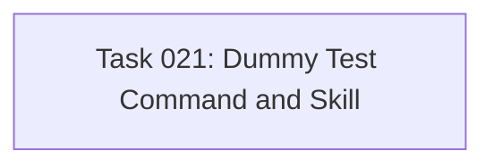

# Tasks for Feature 008: Dummy Test Feature

Generated from: plan.md

## Task List

| ID  | Title                               | Type    | Priority | PR  |
| --- | ----------------------------------- | ------- | -------- | --- |
| 021 | Create Dummy Test Command and Skill | feature | P2       | #31 |

## Dependencies

## Execution Order

1. Task 021 - Single task, no dependencies

## Notes

- This is a minimal test feature with a single task
- Task combines both command and skill creation for simplicity
- Use `/implement 021` to begin autonomous execution
