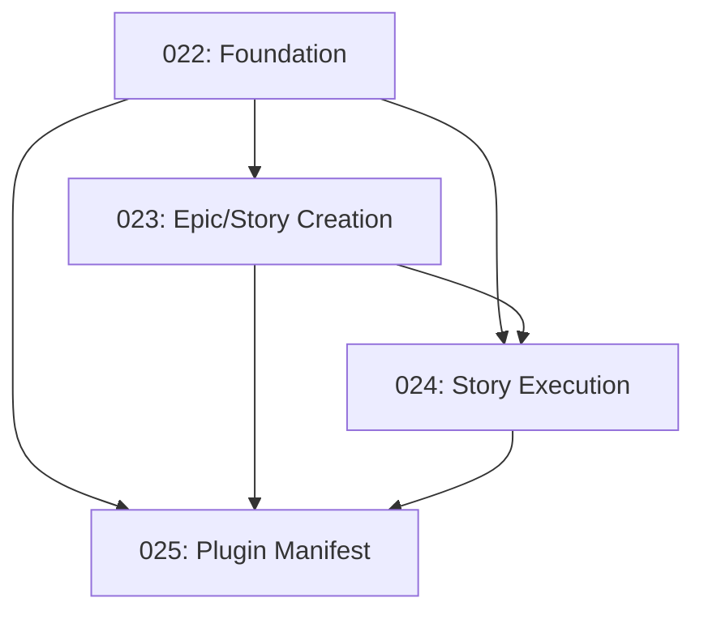

# Tasks for Feature 009: Task System V2 - Epic/Story Architecture

Generated from: plan.md
Generated: 2026-01-17

## Task List

| ID  | Title                                    | Type    | Priority | PR  |
| --- | ---------------------------------------- | ------- | -------- | --- |
| 022 | Phase 1 - Foundation Infrastructure      | feature | P1       | #33 |
| 023 | Phase 2 - Epic and Story Creation        | feature | P1       | #34 |
| 024 | Phase 3 - Story Execution and Resolution | feature | P1       | #36 |
| 025 | Phase 4 - Plugin Manifest and Docs       | docs    | P2       | #35 |

## Dependencies

## Task Summaries

### 022: Phase 1 - Foundation Infrastructure
Create the plugin foundation including:
- Directory structure (`commands/`, `skills/`, `scripts/`)
- `/init` command and skill with `init_structure.sh`
- Shared `identifier_resolver.py` for epic/story resolution
- Templates: `epic-template.md`, `story-template.md`

### 023: Phase 2 - Epic and Story Creation Commands
Create epic and story management:
- `/create-epic` command and skill with AI-assisted dialog
- `/generate-stories` command and skill
- `create_worktree.sh` for branch/worktree/PR creation

### 024: Phase 3 - Story Execution and Resolution
Create execution infrastructure:
- `/implement` command and `execute-story` skill
- `implement.py` orchestrator with worker spawn loop
- `worker-prompt.md` template
- `scope_validator.sh` for story isolation
- `/resolve` command and `resolve-blocker` skill

### 025: Phase 4 - Plugin Manifest and Documentation
Finalize the plugin:
- Update `plugin.json` with V2 commands/skills
- Remove deprecated V1 components
- Document command → skill patterns
- Add usage examples

## Execution Order

1. **Task 022** (Foundation) - Start here, no dependencies
2. **Task 023** (Epic/Story Creation) - After 022 complete
3. **Task 024** (Story Execution) - After 022 and 023 complete
4. **Task 025** (Plugin Manifest) - After all previous tasks complete

## Notes

- Each task has its own worktree in `task-system/tasks/NNN/`
- Tasks can be worked on from different machines using `resume task NNN`
- Use `/implement NNN` to begin autonomous execution on a task
